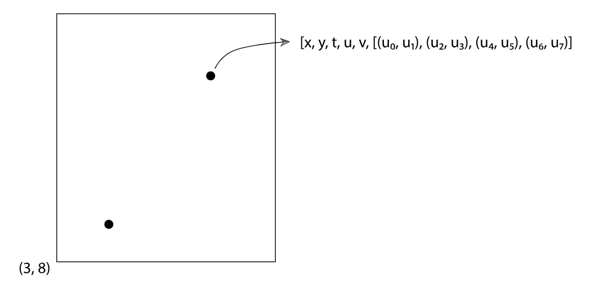

# 写在前面
 这是我阅读pbrt和nori的中文笔记，这里是我非常开心的阅读时光的记录，从前人的知识中我获得了很大的愉悦，所以想把我读到的，我的验证，我的实验写在这里，尽量用中文来写，让母语是中文的人在学习这部分知识时有一些容易理解的参考。我的写作主要是pbrt和nori的翻译，其中会加入一些我的理解和验证。是以一种比较自由的方式来书写而不是逐字逐句地翻译书籍，我想这应该使我更加愉快，也免除了盗用版权的嫌疑：），那么我们开始吧。
## 7.2 采样接口
采样是多维空间中的采样，不仅是2D图像的采样。光线追踪就是采样的方法。包含一些参数。

该图是多维采样在像素空间(x,y)上的投影。
最终合成的图像中像素是以整数为定义域，这里显示的是像素(3，8)的采样，光线追踪的采样空间是定义在实数域，所以这两个点是在像素采样区间内的两个不同采样。其他的采样维度例如时间t ,相机的参数u,v，他们的采样含义会在第14，15，16章的内容进行介绍。7.2章接下来要介绍关于采样标准和方法我更感兴趣的是多维采样的算法。所以这里我要直接跳跃到14章进行我的阅读：），sue~~~

